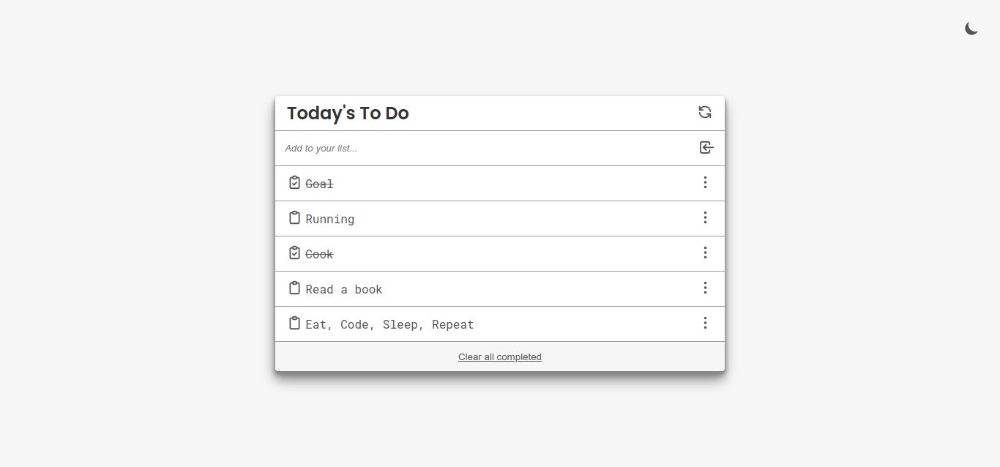
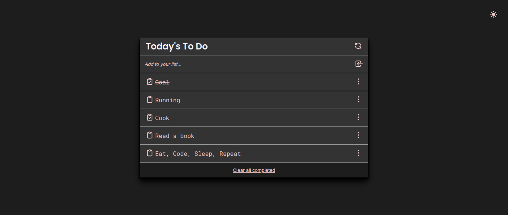

# Todo list

> A simple todo list app that helps you keep track of the most important tasks of your busy day.

## Screenshot

- **Light Mode**

- Dark Mode

## Built With

- HTML, Sass, Javascript(ES6)
- Git/Github, CLI, Webpack, GH-Pages

## Live Demo

[Live Demo Link](https://jssol.github.io/todo-list/)

## Getting Started

To get a local copy up and running follow these simple example steps.

### Setup

To get the project up and running you need a browser.
[The project live link](#Live-Demo-Link)

### Install

To get the project locally, run `git clone git@github.com:jssol/todo-list.git`

### Usage

To get the configuration of the app:
Run `npm install`

To launch the app locally in dev mode:
Run `npm start`

### Run tests

For:

- Eslint: run `npx eslint .`
- Webhint: run `npx hint .`
- Stylelint: run `npx stylelint "**/*.{css.scss}"`

## Author

👤 **Jonathan Sivahera**

- GitHub: [@jssol](https://github.com/jssol)
- Twitter: [@jsivahera](https://twitter.com/jsivahera)
- LinkedIn: [Jonathan Sivahera](https://linkedin.com/in/jsivahera)

## 🤝 Contributing

Contributions, issues, and feature requests are welcome!

Feel free to check the [issues page](../../issues/).

## Show your support

Give a ⭐️ if you like this project!

## Acknowledgments

- Hat tip to anyone whose code was used
- Inspiration
- etc

## 📝 License

This project is [MIT](./MIT.md) licensed.
